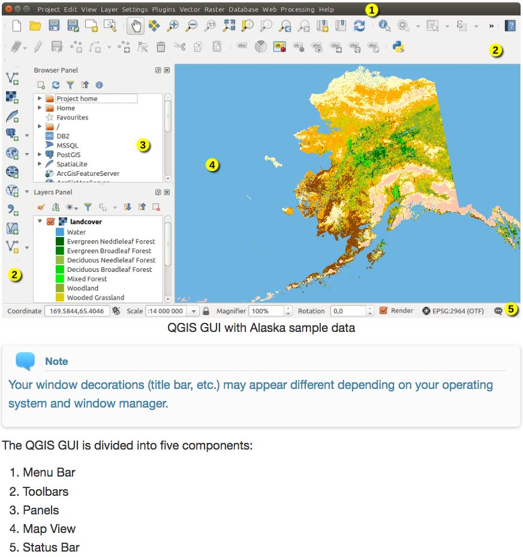
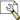

# Mapping 101 - The very basics every data journalist should know about mapping

A workshop held at German investigative journalist conference [Netzwerk Recherche 18](https://nr18.sched.com/event/E4vf) by Hannes Kröger, Patrick Stotz, Achim Tack and Marie-Louise Timcke.

**This document is very much work in progress - come back at the end of June to see the finished version**

## Software Requirements
To follow along during the workshop, please previously perform the follwing steps:  
1. **Install QGIS** (Version 3.0 or later). Download and follow instructions [here](https://www.qgis.org/en/site/forusers/download.html). We recommend QGIS Standalone Installer for Windows and QGIS macOS Installer for Mac.  
2. Once QGIS is running, go to Plugins and Install these Plugins: **QuickMapServices** and **QuickOSM**.  
3. We also recommend **setting the language to English** (Preferences > General). This will make following along and googeling for help a lot easier.  

## Chapter 1: Quickstart QGIS (10 min)

### The basic QGIS user interface (live demo)
Explaing the main user interface components as described in the official [QGIS documentation](https://docs.qgis.org/2.18/en/docs/user_manual/introduction/qgis_gui.html):

### Loading and navigating your first data set (live demo)

1. **Setting up [Browser Panel](https://docs.qgis.org/2.18/en/docs/user_manual/managing_data_source/opening_data.html?highlight=browser#the-browser-panel):** Adding our repository as a favorite location
2. **Loading XXX.geojson:** Simply drag and drop the file to the map view section
3. **Exploring the data set behind the map:** Open the *[attribute table](https://docs.qgis.org/2.18/en/docs/user_manual/working_with_vector/attribute_table.html)*  and explore the fields and values
4. **Map navigation:** Simple zooming  and panning . Zooming to extend, zooming to individual features.
5. **Exploring map features:** Using the *Identify Features*  functionality
6. **Layer Handling:** Adding XXX.geojson. Showing Layer drawing order, hide and show, grouping.
7. **Layer Styling:** Using the [layer styling panel](https://docs.qgis.org/2.18/en/docs/user_manual/introduction/general_tools.html#layer-styling-panel). Quickly demonstrating how to style features and add labels.
8. **Print Composer :** That's where you'll export maps (not part of the workshop)

## Chapter 2: File formats (15 min)
*Wir sollten ganz kurz erklären, was der Unterschied zwischen Raster- und Vektordaten ist. Am besten anhand von Beispielen/Beispielabbildungen*

*Datentypen, die einem als Datenjournalist häufiger begegnen und wie man sie in QGIS einlädt. Beispiele in einen Repository-Unterordner packen und dann live vorführen*
- shapefile
- basemap
- WMS
- WFS
- xls(x) / csv with coordinates
- geotiff

## Chapter 3: Data sources (10 min)
*Hier die häufigsten / nützlichsten Quellen für Datenjournalisten (in Deutschland) aufführen und im Workshop ausschnittsweise zeigen. Am besten thematisch sortiert à la: administrative Grenzen, Luftbilder,OSM...*

- Natural Earth http://www.naturalearthdata.com/
- BKG http://www.geodatenzentrum.de/geodaten/gdz_rahmen.gdz_div?gdz_spr=deu&gdz_akt_zeile=5&gdz_anz_zeile=0&gdz_user_id=0 
- TPHH http://suche.transparenz.hamburg.de/ & http://suche.transparenz.hamburg.de/?extras_registerobject_type=geodat
- OSM
  - Einzelne Features (via Query auf osm.org)
  - Regionale Extrakte
  - Overpass(-Turbo)
  - QuickOSM
- Satellite Data
  - Copernicus
  - Landsat
  - https://remotepixel.ca/
  - https://search.remotepixel.ca/
  - https://github.com/ungarj/awesome-sentinel-2
  - https://github.com/attibalazs/awesome-remote-sensing
  - https://gijn.org/resources-for-finding-and-using-satellite-images/

## Chapter 4: Handling geodata properly (10 min)
*Projektionen, Generalisierung, Dateiformate konvertieren, Geodaten editieren ohne Originaldaten zu zerschießen*
### Projections
Earth is not flat, it's quite spherical. Our maps are usually flat. Projections try to somehow map earth's geography onto a plane (such as a piece of paper or a computer display).
- https://mapschool.io/#latitude--amp--longitude
- https://mapschool.io/projections.html

- Depending on the software used, you might be limited in your choices.

#### EPSG Codes
The European Petroleum Survey Group Geodesy (EPSG) was a working group of European oil and gas exploration companies. She created a system of unique key numbers for map projections which are now used as a standard in the exchange of geodata. Even if there is a very large number of EPSG codes you need to know only a few codes by heart (or on a post-it) in daily use as a (European) journalist:

- EPSG 4326 : WGS 84
- EPSG 3035 : ETRS 59 / LAEA

#### Map of the whole world?
- Do you need to preserve a certain property (like area or direction)?
Try to avoid the Mercator or Galls-Peters projections, their distortions are quite extreme and politically loaded.
- Do you want a nice looking compromise?
  - https://en.wikipedia.org/wiki/Robinson_projection
  - https://en.wikipedia.org/wiki/Natural_Earth_projection
  - https://en.wikipedia.org/wiki/Winkel_tripel_projection
    
#### Map of a specific state or country (or a part of it)
- Use the state/country's official projection. If in doubt, use the local UTM cell/zone.

#### Map of the whole of Europe (or DACH)?
- Use the LAEA projection EPSG:3035
- https://gis.stackexchange.com/questions/209019/what-is-the-ideal-equal-area-projection-to-map-germany-switzerland-and-austria/209020

#### Map of a specific region
- http://projectionwizard.org/ -> Then add as custom projection in QGIS

### Non-destructive display of data using filters

## Chapter 5: Answering spatial questions (15 min)
*Table join, spatial join, buffer* 

Many people use QGIS to create good-looking static maps. But every user should be mindful that geographic INFORMATIONS systems like QGIS are primarily designed to provide answers to questions about spatial information. In the following we will address and solve these questions in a few small examples:

### How many people are affected by an evacuation?

### How many surveillance cameras are there in Berlin's government district?
Of course, one could take a longer walk through the government district to answer this question. However, that would not be really efficient... So we follow a geo-approach by first downloading the input data from Openstreetmap and then spatially filtering them. As a little extra we use the universally loved buffer function.

#### Creating the government district
First, we create a geojson file with the ring of the government district. This is a rare case, in which no already finished geodata are used.

#### Extracting surveillance cams from Openstreetmap
One of my favorite plugins in QGIS is QuickOSM, with which you can very quickly import single features from Openstreetmap into QGIS (hence the very fitting name of the plugin).

#### Select by Location
In our example, both the government district and the cameras are already stored as Geojson in the folder with the example files. So we can now select the cameras that are inside the government district. For this we use the function "select by location".

In the lower bar QGIS displays a message that 123 cameras have now been selected. The selection is displayed in yellow. At the same time, however, it becomes clear that many cameras hang directly outside the government quarter.  Actually, one would also like to count them.

#### Buffering
With the help of the buffer function we can enlarge a given geometry evenly. We use a distance of 50 meters around the government district. The result is a new geometry that we can either temporarily keep in QGIS or save as a new geojson.

If we now carry out the spatial selection from the previous step again, the number of cameras recorded increases to 168.
