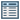
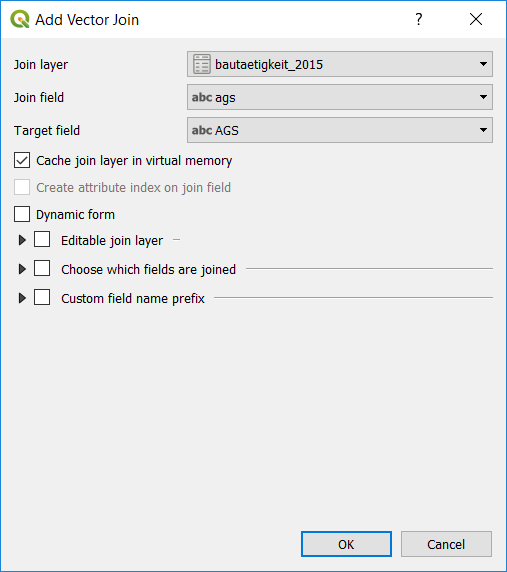
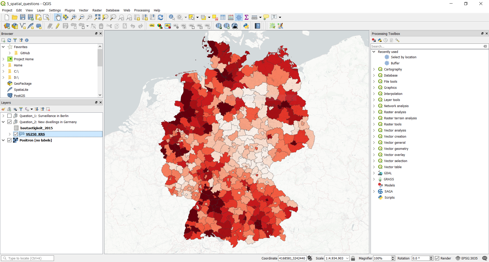
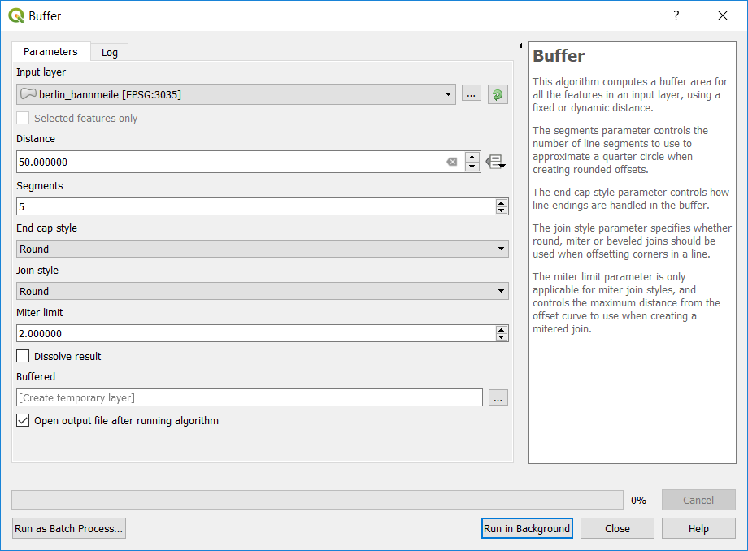

# Mapping 101 - The very basics every data journalist should know about mapping

A workshop held at German investigative journalist conference [Netzwerk Recherche 18](https://nr18.sched.com/event/E4vf) by Hannes Kröger, Patrick Stotz, Achim Tack and Marie-Louise Timcke.

**This document is very much work in progress - come back at the end of June to see the finished version**

## Software Requirements
To follow along during the workshop, please previously perform the follwing steps:  
1. **Install QGIS** (Version 3.0 or later). Download and follow instructions [here](https://www.qgis.org/en/site/forusers/download.html). We recommend QGIS Standalone Installer for Windows and QGIS macOS Installer for Mac.  
2. Once QGIS is running, go to Plugins and Install these Plugins: **QuickMapServices** and **QuickOSM**.  
3. We also recommend **setting the language to English** (Preferences > General). This will make following along and googeling for help a lot easier.  

## Chapter 1: Quickstart QGIS (10 min)

### The basic QGIS user interface (live demo)
Explaing the main user interface components as described in the official [QGIS documentation](https://docs.qgis.org/2.18/en/docs/user_manual/introduction/qgis_gui.html):

### Loading and navigating your first data set (live demo)

1. **Setting up [Browser Panel](https://docs.qgis.org/2.18/en/docs/user_manual/managing_data_source/opening_data.html?highlight=browser#the-browser-panel):** Adding our repository as a favorite location
2. **Loading XXX.geojson:** Simply drag and drop the file to the map view section
3. **Exploring the data set behind the map:** Open the *[attribute table](https://docs.qgis.org/2.18/en/docs/user_manual/working_with_vector/attribute_table.html)*  and explore the fields and values
4. **Map navigation:** Simple zooming  and panning . Zooming to extend, zooming to individual features.
5. **Exploring map features:** Using the *Identify Features*  functionality
6. **Layer Handling:** Adding XXX.geojson. Showing Layer drawing order, hide and show, grouping.
7. **Layer Styling:** Using the [layer styling panel](https://docs.qgis.org/2.18/en/docs/user_manual/introduction/general_tools.html#layer-styling-panel). Quickly demonstrating how to style features and add labels.
8. **Print Composer :** That's where you'll export maps (not part of the workshop)

## Chapter 2: File formats (15 min)

### Raster and vector data
Boradly speaking, geospatial data can be separated in **raster data** and **vector data**.

**Raster data** is like a picture, where each pixel has a value that either represents a color (like in ordinary pictures) or a value like height (elevation data). If you zoom in close enough, raster data will look pixelated.

**Vector data** consists of points, lines and polygons, which means, no matter how far you'll zoom in, you won't see any pixels. Each feature usually has attributes, called properties, that indicate things like area name, how many people live in the given area, election result, etc. 

*For a more detailled, but still brief, explanation see [mapshool.io](https://mapschool.io/#raster). This is where these images are from, too.*

### Shapefiles
This is the file formt you'll probably encounter most often. To explore an example, use the QGIS Browser pane and simply drag and drop */data/shp/ne_110m_admin_0_countries/ne_110m_admin_0_countries.shp* onto the map pane. Quickly explore the data set by zooming and opening the attribute table.

Easy, right? But what do you see, when you explore the content of the */data/shp/ne_110m_admin_0_countries/* folder?
There is more than one file. **Actually a shape file consists of at least three separate files:**
* .shp (where actual geometry data resides)
* .shx (an index enabling faster searches)
* .dbf (a database file containing all the data associated with a geometry of the .shp file)
* ...[optionally some more files/extensions](http://webhelp.esri.com/arcgisdesktop/9.2/index.cfm?id=2729&pid=2727&topicname=Shapefile_file_extensions)

**The one thing you should always remember, when sharing or renaming shape files: Keep them all together. Zip them up before sharing.**

### Geojson / Topojson
Another file format you'll encounter frequently is geojson. Open up both, */data/shp/ne_110m_admin_0_countries/ne_110m_admin_0_countries.shp* and */data/geojson/ne_110m_admin_0_countries/ne_110m_admin_0_countries.geojson* in a text editor to see one of the most important differences.

Not only does a geojson-file actually consist of only one file, but it's also human readable in any editor.
There's a lot to know about geojson if you're working with it more frequently. Read about it [here](https://macwright.org/2015/03/23/geojson-second-bite.html)

**One thing to remember here: geojson-files should always be saved in Web Mercator projection(EPSG:4326)**

### csv or Excel file with coordinates
More often, then you'll expect geodata comes to you in a per se non-spatial file format: csv, tsv, or Excel files that contain points and coordinates.
One example is */data/csv/geonames_germany.csv* a csv files with all cities in Germany with over 15.000 inhabitants (source: [geonames.org](http://www.geonames.org/)). Open it up in your text editor to see what we're dealing with.

Importing this file in QGIS and transforming it into a truly spatial file format can be done with a few easy steps:
1. Use the little  icon (or go to Layer > Add Layer > Add Delimited Text Layer) to open up the import dialogue.
2. Click on the three dots to the right and open *geonames_germany.csv*
3. Set the geometry definition as shown in the screen shot, telling QGIS in which columns it'll find Latitude and Longitude as well as in which projection the data is saved.
4. Add the file to QGIS

- basemap
- WMS
- WFS
- geotiff

## Chapter 3: Data sources (10 min)
*Hier die häufigsten / nützlichsten Quellen für Datenjournalisten (in Deutschland) aufführen und im Workshop ausschnittsweise zeigen. Am besten thematisch sortiert à la: administrative Grenzen, Luftbilder,OSM...*

- Natural Earth http://www.naturalearthdata.com/
- BKG http://www.geodatenzentrum.de/geodaten/gdz_rahmen.gdz_div?gdz_spr=deu&gdz_akt_zeile=5&gdz_anz_zeile=0&gdz_user_id=0 
- TPHH http://suche.transparenz.hamburg.de/ & http://suche.transparenz.hamburg.de/?extras_registerobject_type=geodat
- OSM
  - Einzelne Features (via Query auf osm.org)
  - Regionale Extrakte
  - Overpass(-Turbo)
  - QuickOSM
- Satellite Data
  - Copernicus
  - Landsat
  - https://remotepixel.ca/
  - https://search.remotepixel.ca/
  - https://github.com/ungarj/awesome-sentinel-2
  - https://github.com/attibalazs/awesome-remote-sensing
  - https://gijn.org/resources-for-finding-and-using-satellite-images/

## Chapter 4: Handling geodata properly (10 min)
### Projections
Earth is not flat, it's quite spherical. Our maps are usually flat. Projections try to somehow map earth's geography onto a plane (such as a piece of paper or a computer display).
- https://mapschool.io/#latitude--amp--longitude
- https://mapschool.io/projections.html

- Depending on the software used, you might be limited in your choices.

#### EPSG Codes
The European Petroleum Survey Group Geodesy (EPSG) was a working group of European oil and gas exploration companies. She created a system of unique key numbers for map projections which are now used as a standard in the exchange of geodata. Even if there is a very large number of EPSG codes you need to know only a few codes by heart (or on a post-it) in daily use as a (European) journalist:

- EPSG 4326 : WGS 84
- EPSG 3035 : ETRS 59 / LAEA

#### Map of the whole world?
- Do you need to preserve a certain property (like area or direction)?
Try to avoid the Mercator or Galls-Peters projections, their distortions are quite extreme and politically loaded.
- Do you want a nice looking compromise?
  - https://en.wikipedia.org/wiki/Robinson_projection
  - https://en.wikipedia.org/wiki/Natural_Earth_projection
  - https://en.wikipedia.org/wiki/Winkel_tripel_projection
    
#### Map of a specific state or country (or a part of it)
- Use the state/country's official projection. If in doubt, use the local UTM cell/zone.

#### Map of the whole of Europe (or DACH)?
- Use the LAEA projection EPSG:3035
- https://gis.stackexchange.com/questions/209019/what-is-the-ideal-equal-area-projection-to-map-germany-switzerland-and-austria/209020

#### Map of a specific region
- http://projectionwizard.org/ -> Then add as custom projection in QGIS

### Non-destructive display of data using filters
Many newbies make the mistake of deleting unused data from their layers when working with geodata. This is a quite intuitive procedure but unfortunately not optimal for several reasons: Often the same layers are used in different projects. If you delete elements from the layer, they are now missing in the other projects. Another reason is the lack of flexibility when you need the deleted element again. 
The better (and as we also find faster) way to display only a selection of data is to use filters. QGIS has powerful filter functions with which you can extract and display a subset of data from a larger data set non-destructively.

In our example we want to represent the city of Münster and filter out the city of Münster via the field "gen" (municipality name): "gen"='Münster'.

We realize that not only one but several cities in Germany are called Münster and a filter via the municipality name can quickly lead to errors. Therefore you should ALWAYS filter using the official municipality key (AGS): "ags"='05515000'.

### Converting Geodata to different formats

### Generalisation of geodata (simplifying geometries)
You don't always have access to geodata in different levels of detail and you don't always need the data in the highest spatial resolution for your project. It can even be counterproductive to use very detailed data on slow computers or for use on the web. The process of simplifying geodata is called generalization. There are several tools for this process but we often use the tool http://mapshaper.org/

## Chapter 5: Answering spatial questions (15 min)
Many people use QGIS to create good-looking static maps. But every user should be mindful that geographic INFORMATIONS systems like QGIS are primarily designed to provide answers to questions about spatial information. In the following we will address and solve these questions in a few small examples:

### What is the spatial distribution of new residential buildings in Germany?
This is a very common task: It is required to combine statistical data (e.g. from the Federal Statistical Office) with their corresponding geometry and present the result.

#### Loading the input datasets
We add the two input data sets to our GGIS project, which we want to merge and display together. The Federal Office of Cartography and Geodesy provides a layer with the districts (shapefile) and the Federal Statistical Office a table with the building completions from the year 2015.

The districts are simply added by drag & drop (shapefile). However, this is not quite as easy with the csv file. QGIS requires a csvt file to correctly display the data types per column.

#### Creating the join
The csv file can then be drag & dropped into the project. Now the data from the csv must be linked with the data from the shapefile. Under no circumstances should the name of the municipality be used as a key. There are indeed duplicate church names in Germany. The correct way is the join via the official municipality key (ags).

#### Coloring the map
The data from the csv are now linked to the geometries of the shapefile. The display options can now be used to show the intensity of construction activity per county.

### How many surveillance cameras are there in Berlin's government district?
Of course, one could take a longer walk through the government district to answer this question. However, that would not be really efficient... So we follow a geo-approach by first downloading the input data from Openstreetmap and then spatially filtering them. As a little extra we use the universally loved buffer function.

#### Creating the government district
First, we create a geojson file with the ring of the government district. This is a rare case, in which no already finished geodata are used.

#### Extracting surveillance cams from Openstreetmap
One of my favorite plugins in QGIS is QuickOSM, with which you can very quickly import single features from Openstreetmap into QGIS (hence the very fitting name of the plugin).

#### Select by Location
In our example, both the government district and the cameras are already stored as Geojson in the folder with the example files. So we can now select the cameras that are inside the government district. For this we use the function "select by location".

In the lower bar QGIS displays a message that 123 cameras have now been selected. The selection is displayed in yellow. At the same time, however, it becomes clear that many cameras hang directly outside the government quarter.  Actually, one would also like to count them.

#### Buffering
With the help of the buffer function we can enlarge a given geometry evenly. We use a distance of 50 meters around the government district. The result is a new geometry that we can either temporarily keep in QGIS or save as a new geojson.

If we now carry out the spatial selection from the previous step again, the number of cameras recorded increases to 168.
